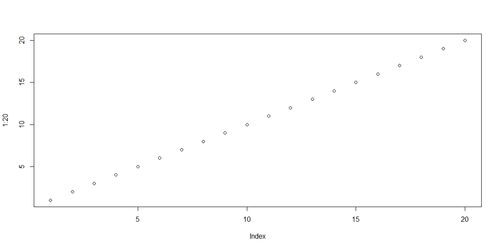

"The huge number driving Trump’s frosty relationship with Germany’s Merkel"

  The second graph in this article is very clean and concise. Each line is labeled directly, so there is no need to look back and forth between the legend and the graph. It also has key data points labeled directly so there is no confusion as to what values they are. Also, bolding the more important data points to help the audiences eyes be drawn to that point. One thing that could help clean up the graph would be to get rid of the x-axis labels, because the data points are already labeled, and to get rid of the grid lines on the chart. They don't add much to the chart, and so shouldn't be included.

For full article, please click [here](https://www.washingtonpost.com/news/wonk/wp/2018/04/27/the-huge-number-driving-trumps-frosty-relationship-with-germanys-merkel/?utm_term=.d9def16f7426)

\
\
\

"The Georgia Primary Offers A Preview Of Democrats’ 2020 Fault Lines"

  The job approval/disapproval chart in this article displays the two viewpoints very well. The color coordination between the line and the data point makes it easy to connect the right percentage to the right line. It also is very clean and clear. The gridlines in the back don't take away from the graph and it isn't cluttered. It also included a nice feature of showing the data points and their values when you hover the mouse over the line. One thing that could be improved is the lengend at the bottom. It isn't clear what the legend is relating to, at least for me. It mentions a projection line of dotted lines, but there is no projection line in the graph.

For full article, please click [here](https://fivethirtyeight.com/features/the-georgia-primary-offers-a-preview-of-democrats-2020-fault-lines/)

\
\
\

"What Happened to a Trump Apartment in New York After the Election?"

  The line graph in this article labels critical points well. Using colors to differentiate between events, the article has labeled when the election happened and when the name of the apartment complex has changed. This allows for the audience to clearly see when these events are taking place and what effect it had on the measurment they were looking at. They also did a good job of fading the gridlines to the background and having clean and clear axis labels. One thing I would to to improve this graphic would be to change the x-axis labels to be a little less cluttered. Listing each year once under the four quarters might do the trick.

For full article, please click [here](https://priceonomics.com/what-happened-to-a-trump-apartment-in-new-york/)

\
\
\

"Where Do All The Assault Rifles Come From?"

There were many charts in this article, but I chose to focus on the first one tat displays the percent change in share price. I think that the colors are a good choice because they are too bright and don't distract from the point of the graph. I also think that the it was a good idea to label important events on the graph itself. They could have put a table next to the chart with the appropriate events and their dates, but why do that when you can put it on the graph. I think there are several things that can be improved on this visual. The gridlines can be discarded completely and the lines can be directly labeled instead of having a legend. Also, the events that are labeled on the graph could be more aligned instead of having diagonal lines everywhere. It is distracting and adds clutter.

For full article, please click [here](https://priceonomics.com/where-do-all-the-assault-rifles-come-from/)

\
\
\

<!-- -->

